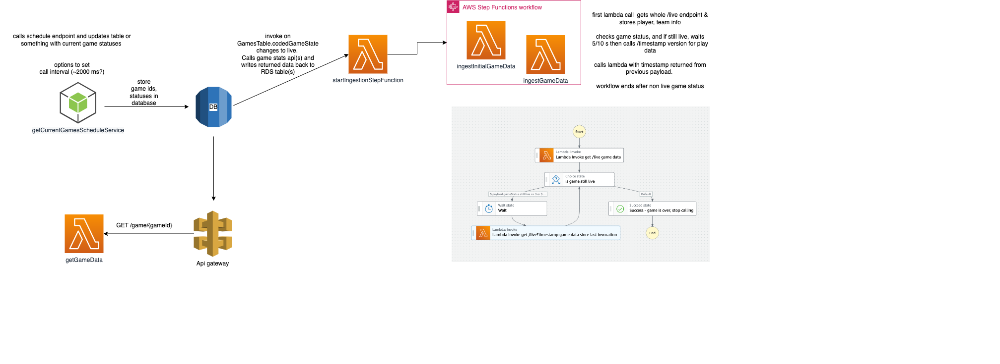

# Sportradar Coding Challenge

NHL Data Pipeline - listens for live game statuses then kicks of data ingestion of player stats while games are live

# Architecture


# Project Structure
- 2 main parts:
  - ServerlessApp - Serverless application. A collection of lambdas, API Gateway endpoint, RDS Database, and Step Function
    - [README.md](./serverlessApp/README.md)
    - this should be deployed first and is currently deployed in an AWS account.
  
  - getGameStatusService - a NodeJS containerized long running service to watch for game status changes and store games in RDS
    - [README.md](./getGameStatusService/README.md)
    - this should be run once serverlessApp is set up
    - this service handles checking for & creating required database tables, triggers, and functions
      - potential for this to be better handled somewhere else and run just on service creation
    - while its running, it continually watches for game status changes to https://statsapi.web.nhl.com/api/v1/schedule for game status changes and updates the database, which kicks off the ingestion process

  - scripts
    - helper scripts for developing. 
    - setupDatabaseLambdaPermissions.sh - cli commands used to configure permissions for Postgres DB to invoke a lambda function
      - this should be worked into ServerlessApp resources as IAM resources for role, policy, and db role attachment but I ran out of time for that
      - once the database is deployed in ServerlessApp, update this with desired AWS account variables and run script 
    - setupECR.sh - creates a new ECR repository for use with ECS tasks, not fully implemented.


# Database Design
 - PostgreSQL database
 - 2 tables: games, game_stats
 ## games table
  - includes update trigger when status changes to 3. Although there are 2 live game codes (3 and 4), I have made assumption for this project that a game will get to 3 (in progress) before it will get to 4 (in progress - critical)
  
 ```   
      Column    |            Type             | Collation | Nullable | Default 
    ------------+-----------------------------+-----------+----------+---------
    gamepk      | integer                     |           | not null | 
    statuscode  | integer                     |           | not null | 
    lastupdated | timestamp without time zone |           |          | 

    Indexes
    "games_pkey" PRIMARY KEY, btree (gamepk)

    Triggers:
      trigger_update_game_status AFTER UPDATE ON games FOR EACH ROW WHEN (old.statuscode IS DISTINCT FROM new.statuscode AND new.statuscode = 3) EXECUTE FUNCTION start_stats_ingestion()
  ```
  

## game_stats table 
```   
          Column     |            Type             | Collation | Nullable | Default 
     ----------------+-----------------------------+-----------+----------+---------
      statid         | bigint                      |           | not null | 
      gamepk         | integer                     |           | not null | 
      playerid       | text                        |           | not null | 
      playername     | text                        |           |          | 
      teamid         | integer                     |           |          | 
      teamname       | text                        |           |          | 
      age            | integer                     |           |          | 
      playernumber   | text                        |           |          | 
      playerposition | text                        |           |          | 
      assists        | integer                     |           |          | 
      goals          | integer                     |           |          | 
      hits           | integer                     |           |          | 
      points         | integer                     |           |          | 
      penaltyminutes | integer                     |           |          | 
      lastupdated    | timestamp without time zone |           |          | 
      Indexes:
          "game_stats_pkey" PRIMARY KEY, btree (statid)
```   

## start_stats_ingestion function 
  - invokes lambda function to start a step function for a live game
```
    CREATE OR REPLACE FUNCTION start_stats_ingestion() RETURNS TRIGGER AS $$
        declare
          v_invoke_command text;
          v_status_code numeric(10);
        begin
        
          v_invoke_command := 'SELECT status_code FROM aws_lambda.invoke(aws_commons.create_lambda_function_arn(''${process.env.LAMBDA_TRIGGER_ARN}''),'
                        ||'''{"GameId": "' || NEW.gamepk || '" }''::json)';
      
          execute v_invoke_command into v_status_code;
        RETURN NEW;
      
        exception
        when others then
          raise notice '% %', SQLERRM, SQLSTATE;
          raise notice '% %', SQLERRM, SQLSTATE;
        RETURN NULL;
        END;
      $$ LANGUAGE plpgsql;
```